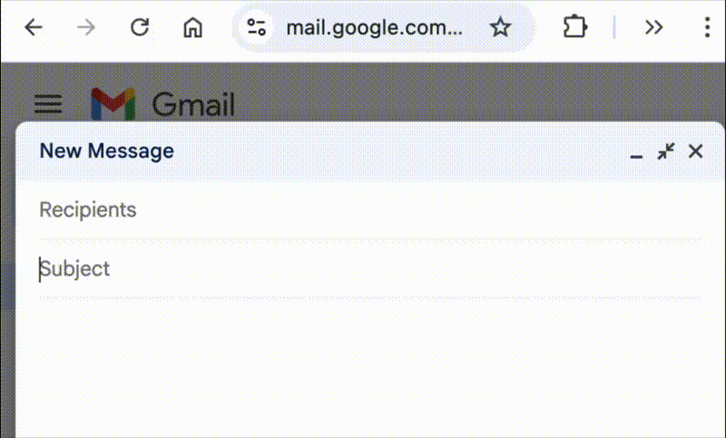

## Weekday Checker

A browser extension that scans text input and emits a warning if the day of the week / date combo entered is invalid.

## Installation

### Chrome

Install [Weekday Checker in the Chrome Web Store](https://chromewebstore.google.com/detail/weekday-checker/phbbmhafgcohoiimbekcnnhoegcimfgm).

### Firefox

Coming soon

## How it works

The plugin watches text being written into text boxes and scans for snippets that look like dates including the day of the week. It then determines what day of the week that is (after determining which year, see below), and if that date differs from the one written in the text, it pops up a simple alert.

After you clear the alert, it doesn't warn you again about that specific date in that specific text field.

It is designed to be non-invasive, doesn't make any external calls, and doesn't store any information anywhere.

### Which year?

In order to determine whether the day of the week is incompatible with the date, we need to know which year the date is in. Namely, Jan 1 might be a Tuesday in one year and Wednesday in the next.

The logic looks for the closest instance of that particular date in the previous, current, or next year, and applies the calculation to the date in that year.

I considered taking a year into account, so typing "Sunday, Jan 1, 2001" would look in that year, instead of the year with the closest Jan 1. The tricky part is knowing that a year is *coming* after, and deferring the alert until we can incorporate that data into the calculation.

If this seems counterintuitive to you, or you run into issues where it picks the wrong date, reach out and we can come up with improved logic!

## Developing

### Requirements

Building requires Node.js and npm, which can be installed from [nodejs.org](https://nodejs.org/).

The following build environments are known to work:

* macOS 26.5.2, Node.js 26.3.0, npm 11.16.0
* Debian GNU/Linux 12 (bookworm), Node.js 18.20.4, npm 9.2.0

### Setup

`npm ci`

### Test

#### Chrome

1. `npm run build`
2. Go to chrome://extensions
3. "Load Unpacked"
4. Select directory

#### Firefox

1. `npm run build`
2. `npx web-ext run`

### Release

1. Create and publish a GitHub release with a tag such as v1.2.0.
2. Download `weekday-checker.zip` and `weekday-checker-source.zip` from the release.
3. Upload to browser providers:
   * Chrome Web Store (TODO: how?)
   * Firefox Add-ons (TODO: how?)
